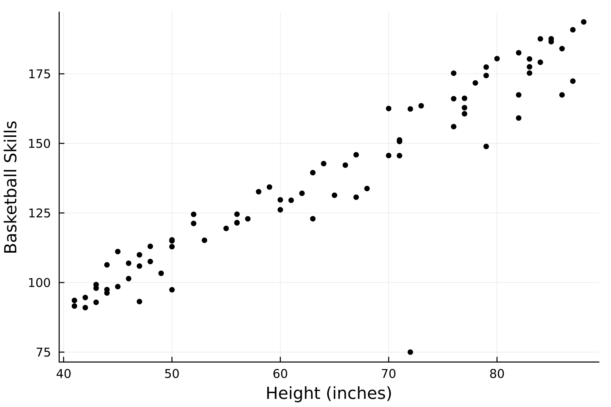
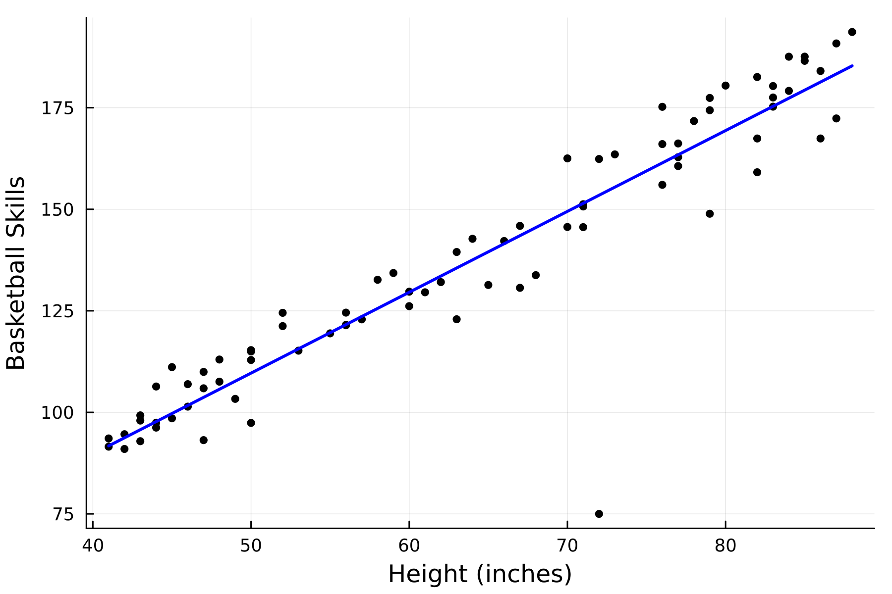

# Linear Regression Example

Let's try using *Values* to fit a line to data, using gradient descent.

First, we'll make up some fake data of two things with an assumed-linear relationship: height and basketball-skills. We'll define the true slope and intercept of the relationship as ``m=2`` and ``b=10``.

```julia
using Random
Random.seed!(1234)
# seeding the random number generator for reproducibility

heights = Float64[]
for count in 1:79
    push!(heights, rand(40:90))
end


# TRUE PARAMS y = m*x + b
m = 2
b = 10


skills = Float64[]

for height in heights
    skill = m * height + b + randn() * 7.0
    push!(skills, skill)
end
```

Just for fun, I'll add myself to this dataset. I'm 72 inches tall, and extremely bad at basketball lol

```julia
push!(heights, 72)
push!(skills, 75)
```

Now let's plot the data just to take a look at it:

```julia
using Plots
scatter(heights, skills, legend=false, markersize=3, color=:black, xlabel="Height (inches)", ylabel="Basketball Skills",dpi=300)
```




Ok, now let's see if we can use *Values* to fit a line to this data. First, we'll cast all of the height and skill measurements we have to *Values*

```julia
heights = [Value(item) for item in heights]
skills = [Value(item) for item in skills]
```

Next we'll set two hyper-parameters. We'll set the learning rate `lr = 0.000002` and the number of iterations of the fitting to `runs = 100000`.

```julia
lr = 0.000002
runs = 100000
```

Now we'll define our initial guesses:

```julia
m_guess = Value(0)
b_guess = Value(0)
```

Now we can actually fit the parameters to the data. We'll do this with `runs = 100000` iterations, updating the parameters each time. For each iteration, we start by reseting the `m_guess` and `b_guess` gradients to 0. Then, we set `global loss = Value(0)`. We then iterate through our `heights` array, and calculate the predicted skills using our current parameters as: `skill_pred = heights[i] * m_guess + b_guess`. We then compare the predicted skill level to the actual skill level for that height and compute the squared error between them: `loss_to_add = (skill_pred - skills[i])^2`. Then, we add that amount to the total loss: `global loss += loss_to_add`. All of these calculations are valid operations for our *Values*, so at this point we can call `backward(loss)` to calculate the gradients of the parameters. We then update the parameters in the opposite direction of the gradients, scaled by the learning rate. Here's the entire block of code:

```julia
for run in 1:runs

    # reset the grads to 0 for each iteration
    m_guess.grad = 0
    b_guess.grad = 0

    # set loss to 0
    global loss = Value(0)

    for i in 1:length(heights)

        # predicted skill level, using our parameters
        skill_pred = heights[i] * m_guess + b_guess 

        # squared error compared to actual skill level
        loss_to_add = (skill_pred - skills[i])^2

        global loss += loss_to_add
    end

    # backward pass to calculate the gradients
    backward(loss)

    # updating parameters
    m_guess.data -= m_guess.grad * lr
    b_guess.data -= b_guess.grad * lr

end
```

Let's see where our guesses for *m* and *b* are at now.

```julia
println(m_guess)
# output: Value(1.9906384976156302)

println(b_guess)
# output: Value(10.133894222774007)
```

Pretty close to the real values that we originally used to make the data! We can also plot the fit line with these `m_guess` and `b_guess` parameters:

```julia
heights_data = [item.data for item in heights] # remember heights is full of Values, so need to do this to get the numbers

x_line = minimum(heights_data):maximum(heights_data)
y_line = m_guess.data * x_line .+ b_guess.data
plot!(x_line, y_line, linewidth=2, color=:blue)
```



